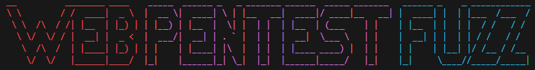

# WEB PENTEST FUZZ



めんどくさいWebの基本確認事項は一括で見よう✨

## 使い方

```
python ./main.py <URL>
```

## テスト範囲

- ✅ robots.txtの確認
- ✅ Readmeファイルの漏洩
- ✅ Git漏洩の確認
- ✅ ディレクトリリスティングの有無を簡易特定
- ✅ jQueryバージョン特定
- ✅ WordPressスキャン
- ✅ Webサーバーのバージョン簡易特定

